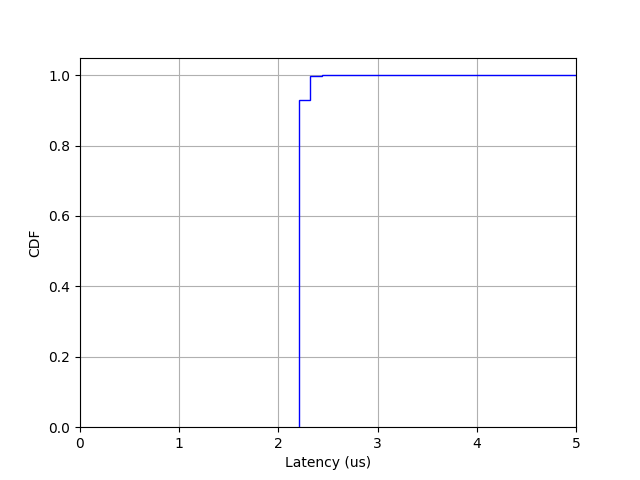

<a href="https://zenodo.org/badge/latestdoi/679104428"></a>
# ActiveRMT: Enabling Active Networking on Programmable Switches
ActiveRMT enables running active programs on programmable switches based on the Tofino Native Architecture (TNA). This repository contains the tools necessary to write user-defined applications that can take advantage of memory and compute on Tofino switches. This repository contains the following:
1. Control plane and data plane software to run active programs.
2. A DPDK library to write user-space active applications.
3. A Linux shim layer to enable POSIX-socket based active applications.
4. Examples.

## Getting Started
### Minimum Requirements
The following are the minimum requirements for exercising this system without a Tofino ASIC:
1. Intel SDK (https://www.intel.com/content/www/us/en/products/details/network-io/intelligent-fabric-processors/p4-studio.html) version 9.7.0.
2. Linux (x86) machine (Ubuntu focal or higher).

### Setting up ActiveRMT
We will use a default routing configuration to test ActiveRMT on the Tofino model emulator. The routing configurations are located at "config/". Routing tables have the format "ip_config_<id>.csv", where <id> refers to a routing configuration (e.g. model).

Perform the following steps to get ActiveRMT running on the Tofino model:
1. Install the SDK according to Intel documentation. You should have the *SDE* variable set correctly post installation. You should also have a set of utility scripts installed at the *SDE* location or provided by Intel.
2. Perform a shallow clone of this repository and third-party modules:
```
git clone --depth 1 git@github.com:dasrajdeep/activermt.git
git submodule update --init --recursive
```
3. Build the P4 source for ActiveRMT.
```
cd activermt/dataplane
$SDE/p4_build.sh active.p4 P4FLAGS="-Xp4c=--traffic-limit=80"
```
4. Run the Tofino model.
```
cd $SDE
run_tofino_model.sh -p active
```
5. Run the driver.
```
cd $SDE
run_switchd.sh -p active
```
6. Create and edit the necessary configuration files. Copy the "controller.json" file from the "config" folder to *$SDE*. Edit the *BASE_PATH* variable to point to the root directory of this (cloned) repository. The *IPCONFIG* variable is whatever you set it to be (e.g. asic). This variable is used to determine which routing configuration to use. For example, the routing configuration files in the "config" folder are named to "ip_config_model.csv" and "arp_table_model.csv" for *IPCONFIG=model*. Each line in the "ip_config_<IPCONFIG>.csv" file has the format "<ip_address>,<port>". Each line in the "arp_table_<IPCONFIG>.csv" file has the format "<ip_address>,<mac_address>,<port>". Create the corresponding routing configuration files if you change the *IPCONFIG* variable.
7. Run a PTF test to install a minimal runtime and test the system. The test runs a "NOP" program (activermt/tests/nop/nop.ap4) that runs a dummy program to check execution at the switch. Upon execution of the program, a flag is set in the ActiveRMT Initial Header to indicate the same. The packet is routed according to the default routing table. The test setup configures the runtime to recognize instructions from the active program.
```
cd <activermt_source_dir>/activermt/tests
$SDE/run_p4_tests.sh -p active -t nop/
```
If the test passes, then the ActiveRMT dataplane is set up correctly and ready to run active programs.

## Running an application
Now that we have tested a working ActiveRMT, we can write an active application for an activated switch. Note that you will require a Tofino ASIC for the rest of this document. If you do not have one, you may be able to create a virtual switch using the Tofino model running on a x86 machine. This document does not however, cover the details of how to do so.

### Requirements
The following hardware and software requirements must be met:
1. A Tofino ASIC.
2. Intel SDK for Tofino.
3. A DPDK capable NIC (http://core.dpdk.org/supported/nics/) for running active network applications.
4. DPDK (https://doc.dpdk.org/guides/index.html).
5. A Linux (x86) machine, preferrably running Ubuntu (focal or higher).

### Dependencies
The following software dependencies for Linux are also required:
1. Python3
2. Scapy
3. Numpy
4. Pandas
5. Matplotlib

### Setting up the ASIC
We assume that you have a Tofino switch configured according to the vendor specifications, and at least one x86 machine connected to one of the switch ports. The software has been tested on SDE 9.7.0 and we recommend using the same for the evaluation. Ensure that the environment variables *SDE* and *SDE_INSTALL* are set correctly. Clone the repository on the switch CPU. You will need the contents of the "activermt" folder on the switch. A set of utility scripts used below can be found in the *$SDE* directory or provided by the vendor.

Compile the P4 program *active.p4*. Run the driver, load the active program onto the switch ASIC (the name of the program is "active") and configure the ports. Assuming you have the scripts "p4_build.sh" and "run_switchd.sh", the following are the sequence of operations you need to perform:

```
<path_to_p4_build.sh> active.p4 P4FLAGS="-Xp4c=--traffic-limit=80"
<path_to_run_switchd.sh> -p active
```

The dataplane is now ready to run active programs. Next, you need to run the controller to enable stateful applicartions. Our controller uses the BFRT Python APIs to interact with the dataplane. Assuming you have a script named "run_bfshell.sh", run the following command:
```
<path_to_run_bfshell.sh> -b <path_to_controller.py> -i
```

The controller is now ready to admit new applications. 

The examples folder contains applications that use the active runtime. Before we evaluate stateful applications such as a key-value store, let's run a stateless application based on DPDK. Make sure that DPDK is installed and the environment variables set correctly.

### A stateless application: ping
The "examples/ping/activesrc" folder contains the active program for an example (active) ping application. The active program simply echoes the packet to the ingress port while swapping the Ethernet and IP addresses. The DPDK application measures the ping times of several packets and saves the corresponding results. You will first need to generate the bytecode for the active program as follows:
```
cd examples/ping/activesrc
../../../tools/ap4.py ping.ap4
```

A DPDK application that measures ping times to the switch is located at the "examples/ping/app/dpdk" folder. Next, build the application by running `make` inside the folder. A helper script "launch.sh" is also present in the directory which launches the application. Quit the application after some time pressing "Ctrl+C". A CSV file containing measured ping times should be present in the same folder. Run the plotter script by typing `./plotter.py`. A PNG plot (cdf) of the ping times should be generated in the same folder as below:


### A stateful application: key-value store (cache)
A key-value store implementation from the paper can be found at "examples/kv_store". The "activesrc" directory as before contains two active programs - one for heavy-hitter or frequent item detection (hh.ap4) and the other for reading objects from the switch key-value store (kvstore.ap4). Build the active program for the key-value store as follows:
```
cd examples/kv_store/activesrc
../../../tools/ap4.py kvstore.ap4
```

Next, build the DPDK app:
```
cd examples/kv_store/app/dpdk/client
make
```

Finally, launch the app by running `./launch_concurrent.sh` from the containing folder. After about 25 seconds, you can quit the app by typing "Ctrl+C". You can refer to the log (rte_log_active_cache.log) generated in the same folder to quit the app a few seconds after "FID 4" is active. A set of CSV files should be generated in the same folder. Copy them to the evals folder in the same directory and run the plotter from there:
```
cp cache_rx_stats*.csv evals/
cd evals
./plotter.py
```
A PNG plot should be generated in the same folder as below:


## Microbenchmarks
Programs for running microbenchmarks are present in various folders of the repository. In particular, scripts for generating microbenchmarks for the allocator are located in the "malloc" folder. The analyses correspond to the ones in the paper where application arrivals are mimicked and the corresponding allocation times, for example, are measured. Each such analysis is defined by a configuration present in the "malloc/config" folder. To run an analysis, you need to specify the configuration. For example,
```
cd malloc
./analysis.py config/config_16.json
```

After the script finishes execution, data will be generated inside the "evals/data" directory, corresponding to the configuration name. You can generate plots from the same folder as follows: 
```
./plotter_constrained.py evals/data/results_config_16/ config/config_16.json
```

The "evals/plots" directory will contain PNG files corresponding to the plots. For example, "config_16" will generate the following allocation time plot:


